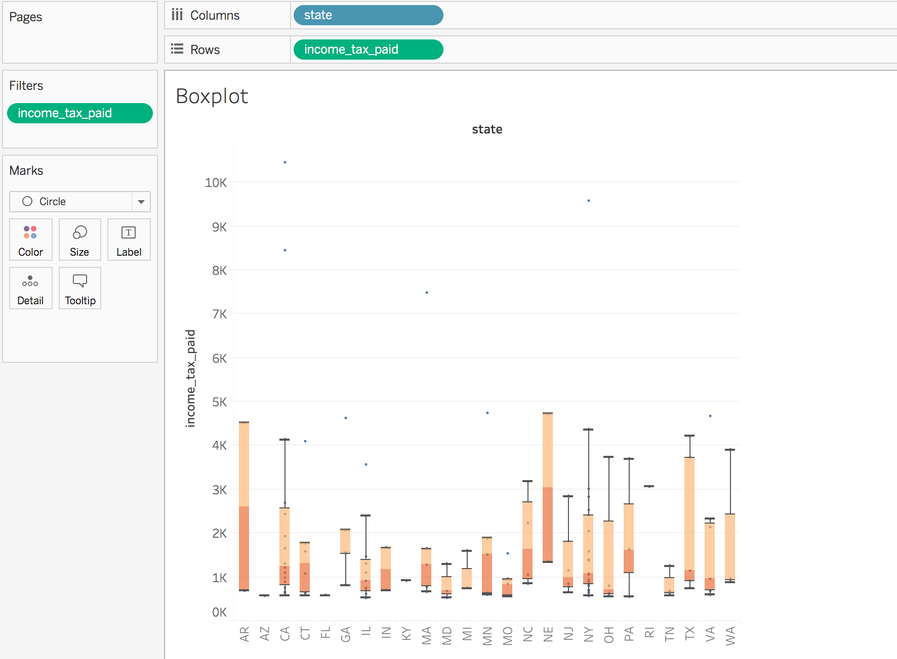
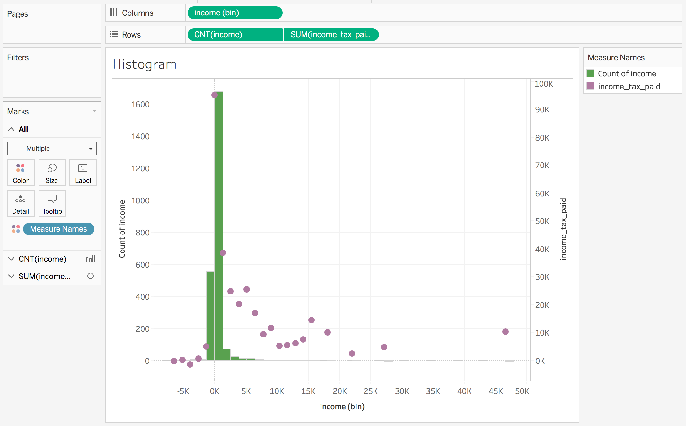
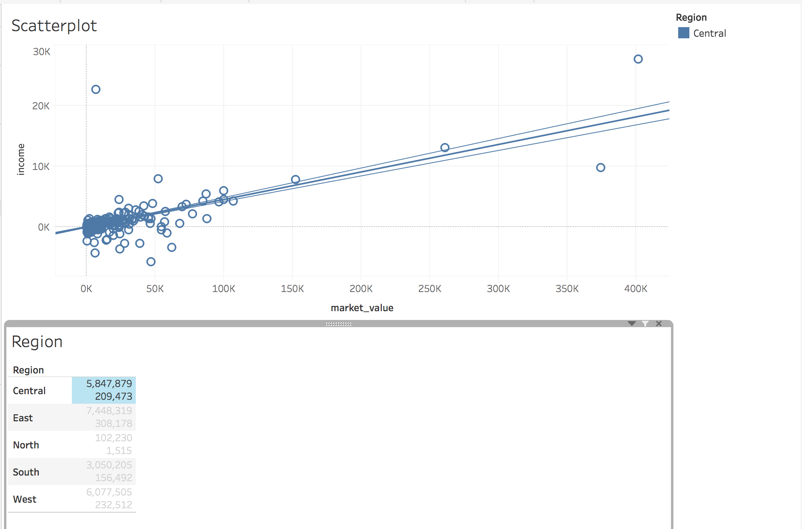
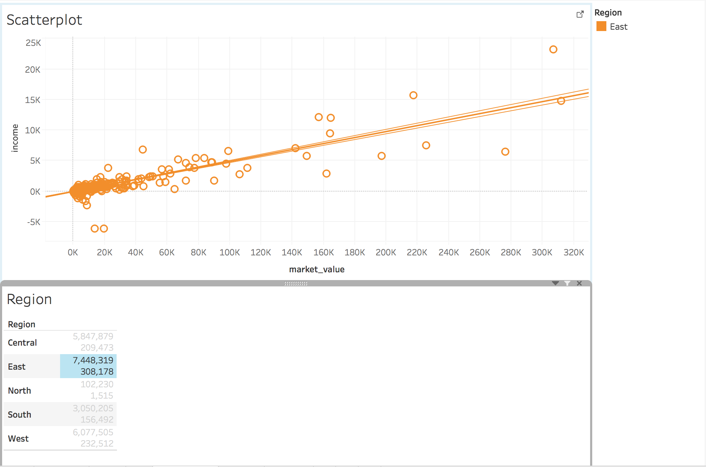
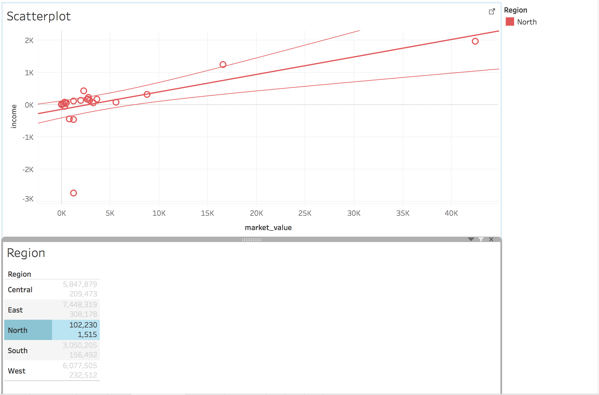
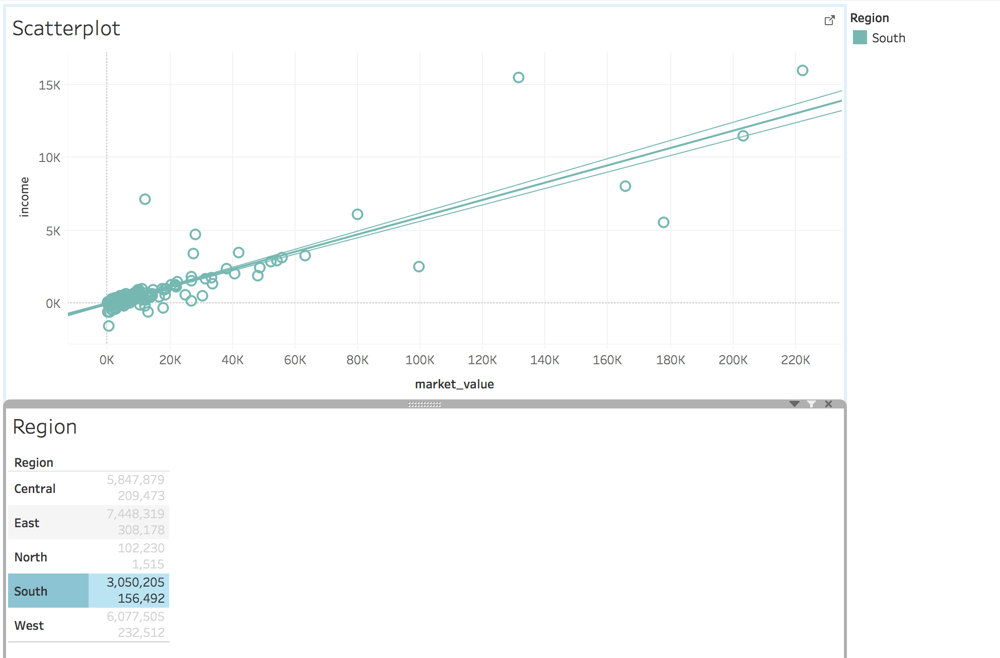
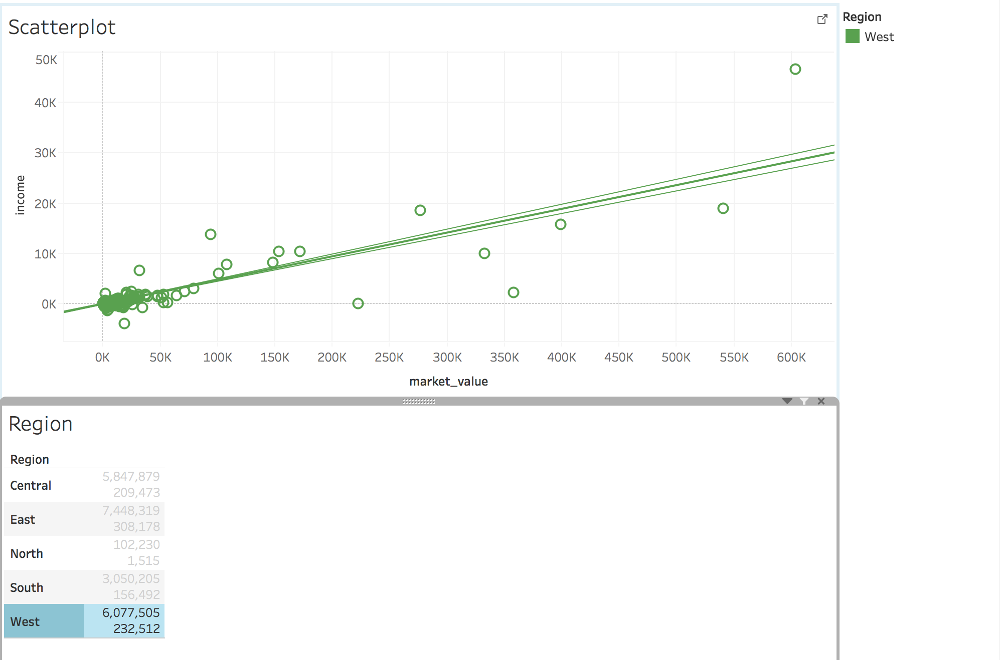
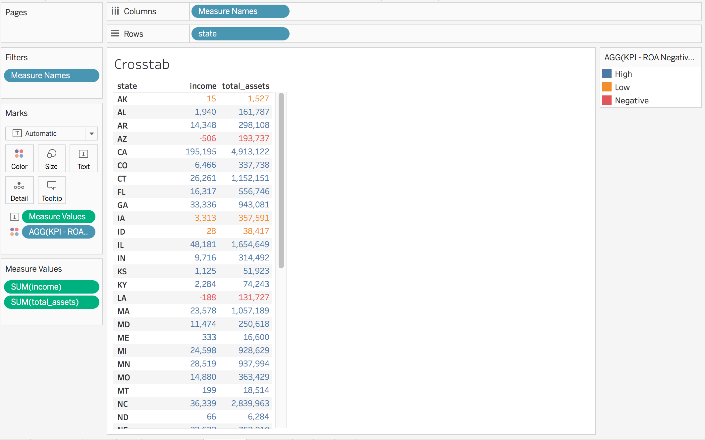
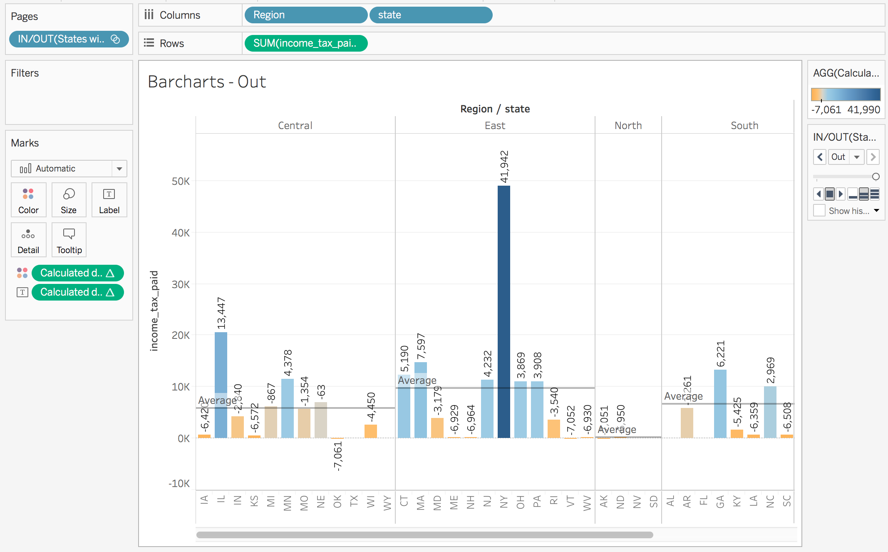
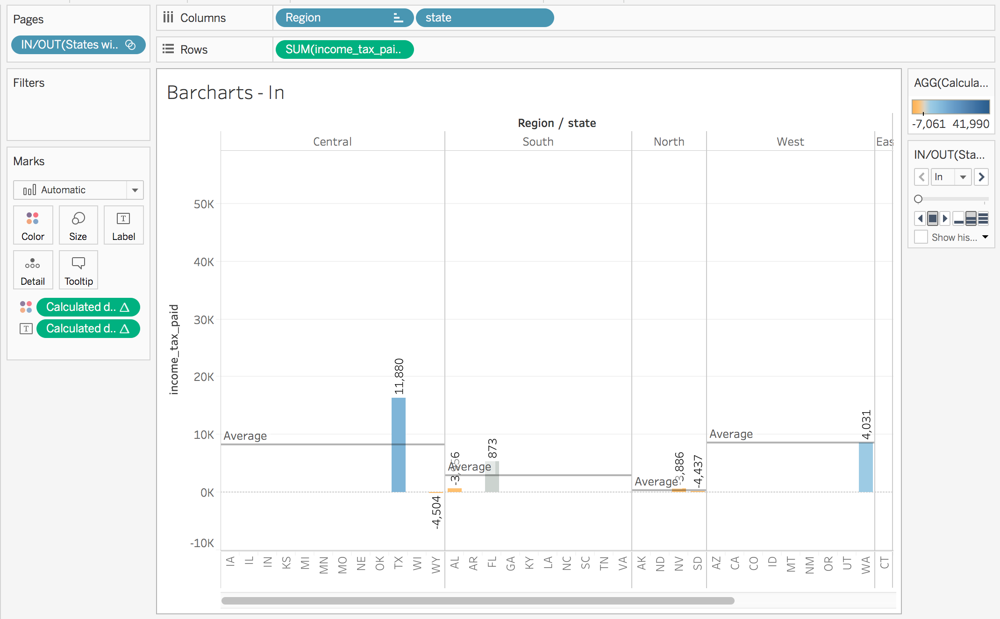

```{r setup, include=FALSE}
knitr::opts_chunk$set(echo = TRUE)
```

## Steps we took to complete project

###ETL ("Clean Up") the Data -
 
```{r ETL, results = 'hide', message= FALSE}
source ("../01 Data/R_ETL.R")
```

####Step 1:
Open CSVs as Data Frame
```{r} 
file_path = "../01 Data/PreETL_US_Companies.csv"
file_path1 = "../01 Data/PreETL-LargestIndustry.csv"
file_path2 = "../01 Data/PreETL-Region.csv"
```
####Step 2:
Changed Column Names
```{r} 
names(df) <- c("id","date","year","industry_format","ticker","name","currency","total_assets","income","employee","total_liabilities","income_tax_paid","operating_expenses","status","market_value","price","city","abbreviation")
names(df1) <- c("state","abbreviation","largest_industry")
```

####Step 3:
Identified measures and dimensions 
```{r} 
measures <- c("total_assets","income","employee","total_liabilities","income_tax_paid","operating_expenses","market_value","price")

dimensions <- setdiff(names(df), measures)
```

####Step 4:
Cleaned up measures and dimensions by removing Google Ascii 

####Step 5:
For dimensions, removed: NA's, & and Quotes

####Step 6:
For measures, removed: non-digits

####Step 7:
Removed all entries without any values 
```{r} 
df = df[complete.cases(df),]
```

####Step 8:
Write to CSV

```{r} 
write.csv(df, gsub("PreETL_", "", file_path), row.names=FALSE, na = "")
write.csv(df1,gsub("PreETL-", "", file_path1), row.names = FALSE, na = "")
write.csv(df2,gsub("PreETL-", "", file_path2),row.names = FALSE, na = "")
```


###Data Description
This data set contains the following fields:

<b>-id </b> - unique id for all the listed companies of United States

<b>-date </b> - yearly report date

<b>-year </b>- 2016 fiscal year

<b>-industry_format </b>- This code indicates whether a company reports in a Financial Services or Industrial format.

<b>-ticker</b>- This item identifies the symbol associated with trading of a particular issue on an exchange.

<b>-name </b>- company full name

<b>-currency </b>- Currency that the company is collected in.
USD = U.S. dollars
CAD = Canadian dollars

<b>-total_assets (in million) </b>- This item represents the total assets of a company at a point in time.

<b>-income (in million) </b> - This item represents the total comprehensive income to the company, which means it includes amounts attributable to both the parent and the noncontrolling interest.

<b>-employee(in thousand) </b>- This item represents the number of people employed by the company and its consolidated subsidiaries in thousands.

<b>-total_liabilities (in million) </b>- This item represents current liabilities plus long-term debt plus other noncurrent liabilities, including deferred taxes and investment tax credit.

<b>-opearting_expenses (in million) </b> - This item represents operating expenses to the company during the specific fiscal year, according to GAAP.

<b>-status </b>- This item indicates whether the company is currently active or inactive on the Compustat database.
A = active
I = inactive

<b>-market_value (in million) </b>- Market value for single issue companies is common shares outstanding multiplied by the month-end price that corresponds to the period end date

<b>-price </b>- Stock close price at the fiscal-end date

<b>-city </b>- Headquarter city

<b>-abbreviation </b>- Headquarter state abbreviation


<b>-state </b> state where headquarters is located

<b>-largest_industry </b> the largest industry within the state

<b> -Region </b> Region where state belongs


###Joining the Data

We joined the data using a inner join to combine states with their respective regions. 


```{}
SELECT id, date, year, industry_format, ticker, name, currency, total_assets, income,
       employee, total_liabilities, income_tax_paid, operating_expenses, status, market_value, price,
       city, US_Companies.csv.abbreviation, state, largest_industry
       FROM 'US_Companies.csv', 'LargestIndustry.csv'
       WHERE US_Companies.csv.abbreviation = LargestIndustry.csv.abbreviation
```
#Tableau

###Non-Aggregated Measures Analysis
-We did a boxplot showing states with how much total income tax companies that were headquatered in each state.
  <center></center>

###Aggregated Measures Analysis
-For this case, we did a histogram dual axis histogram showing income in bins versus count of total income on y1 axis and income paid individually by each company on y2 axis.
  <center></center>

###Scatter Plots
-We also created a scatter plot ploting market value vs income then creating an Action to filter for each of the four Regions. We also created a dashboard that has the scatterplot along with a table highlighting the total market value and income for each Region.
  <center></center>
  <center></center>
  <center></center>
  <center></center>
  <center></center>

###Crosstabs
-For this section, we created a crosstab that has state in one column, total income in another column and total assets for each state in another column. Each state is colored by the KPI we created in which we evaluate the state's Return on Assets (ROA). A High ROA state is colored blue, a Low ROA state is orange while a Negative ROA is colored Red.
  <center></center>

###Barcharts
-In this section, we divided the Regions and the total income paid by each state. We created a set that shows states that have a state income tax versus the companies that don't. We created a Calculated Field that calculated the difference from the average income tax for each Region.
  <center></center>
  <center></center>

## Shiny


  After we had workable data, we developed a Shiny App. Each tab of the Shiny App displays the a visualization using ggplot code of the following types: Boxplot, Histogram, Scatterplot, Crosstabs, Barcharts, Geographic(Map)
  
If you wish to run the app, it is under 02 Shiny. It is also hosted with this URL. https://chriswongwr.shinyapps.io/final_project/

  